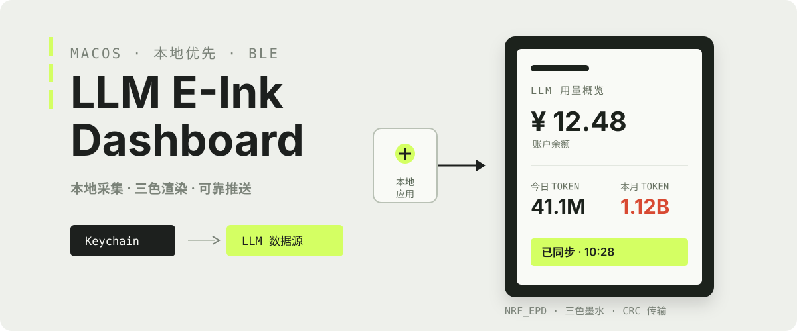
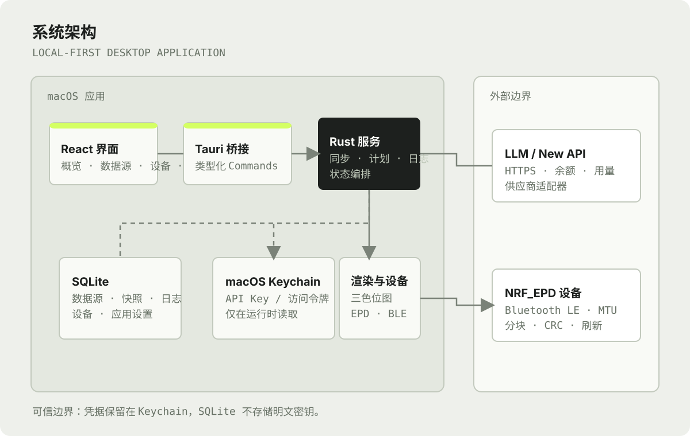
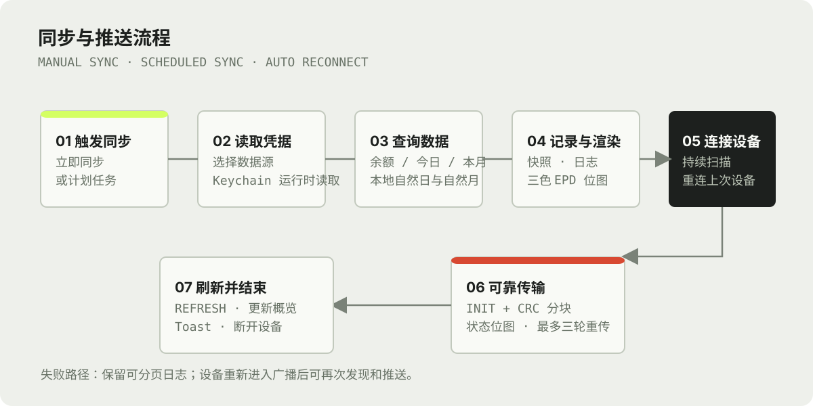

# LLM E-Ink Dashboard

<p align="center">
  
</p>

<p align="center">
  <strong>macOS 本地优先的 LLM 用量仪表盘</strong><br>
  从数据源读取余额与 TOKEN 用量，渲染为三色电子墨水屏画面，并通过 BLE 推送到 <code>NRF_EPD</code> 设备。
</p>

<p align="center">
  
  
  
  
</p>

## 它解决什么问题

LLM E-Ink Dashboard 将账户余额、今日 TOKEN 和本月 TOKEN 集中到一个离线可用的 macOS 应用，并同步到低功耗三色电子墨水屏。密钥只保留在 macOS Keychain；业务数据、日志和设备配置只落在本机 SQLite。

| 能力 | 说明 |
| --- | --- |
| 数据源 | DeepSeek、OpenAI-compatible、New API 与受控脚本数据源。 |
| New API 统计 | 通过个人访问令牌读取余额，并按本地自然日、自然月汇总 `token_used`。 |
| 三色 EPD | 生成预览，使用黑、白、红三色图层，并执行 CRC 分块、状态校验和缺块重传。 |
| 自动同步 | 计划任务刷新数据，扫描并连接上次使用的设备，推送完成后主动断开。 |
| 可追溯性 | 本地分页日志记录同步、连接与传输事件，并自动保留最近 30 天。 |

## 系统架构

<p align="center">
  
</p>

| 层 | 主要位置 | 职责 |
| --- | --- | --- |
| 界面 | `src/app` | React 页面、Toast、设备菜单、版本与同步状态。 |
| 桥接 | `src/lib/tauri.ts` | 前端对 Tauri Commands 的类型化调用。 |
| 应用服务 | `src-tauri/src/commands.rs` | 数据源、同步、设备、计划、日志与设置编排。 |
| 适配与持久化 | `providers`、`storage`、`secrets` | 供应商查询、SQLite 业务数据与 Keychain 凭据引用。 |
| 设备与图像 | `ble.rs`、`epd`、`render` | BLE、EPD 报文、三色渲染、预览与重传。 |

### 本地可信边界

- API Key 与个人访问令牌仅保存于 macOS Keychain，SQLite 和前端持久化状态不保存明文密钥。
- `secret_ref` 只是 Keychain 引用；数据源删除时会同时清理其凭据引用。
- 自定义脚本仅接受 UTF-8 JSON，有 30 秒超时和 1 MB 输出上限。

## 同步与推送

<p align="center">
  
</p>

### New API 的统计边界

个人访问令牌模式需要配置 `baseUrl`、`userId` 与访问令牌。统计请求均发生在应用后端，令牌不会传给前端。

| 指标 | 接口 | 时间范围 | 汇总字段 |
| --- | --- | --- | --- |
| 余额 | `/api/user/self` | 当前账户 | `quota`、`used_quota` |
| 今日 TOKEN | `/api/data/self` | 本地时区当天 `00:00` 到当前时间 | `token_used` |
| 本月 TOKEN | `/api/data/self` | 本地时区当月 1 日 `00:00` 到当前时间 | `token_used` |

针对 CDN 缓存或截断响应，时间段查询附带唯一请求标识和无缓存头；应用连续查询三次并选择最大有效汇总值。快照记录无敏感信息的查询起止时间与记录数，便于排查数据差异。

## EPD 兼容性

设备需要以 `NRF_EPD` 开头广播，并暴露 EPD vendor 服务。

| 项目 | 值 |
| --- | --- |
| 服务 UUID | `62750001-d828-918d-fb46-b6c11c675aec` |
| 控制特征 UUID | `62750002-d828-918d-fb46-b6c11c675aec` |
| 特征能力 | 同时支持 Write 与 Notify 或 Indicate |
| 固件 `>= 0x20` | CRC 分块、状态位图校验与缺块重传 |
| 旧固件或版本未知 | 使用传统图像传输回退路径 |

传输完成表示报文和设备状态已确认；设备实际刷新画面仍是最终验收依据。

## 快速开始

### 环境

- macOS 11 或更高版本
- Node.js 22
- Rust stable 与 Xcode Command Line Tools
- 蓝牙与 Keychain 访问权限，用于真实设备和数据源验证

### 本地运行

```bash
npm ci
npm run tauri dev
```

### 质量检查

```bash
npm run build
cargo test --manifest-path src-tauri/Cargo.toml
cargo fmt --manifest-path src-tauri/Cargo.toml -- --check
```

### 构建 DMG

```bash
npm run tauri build -- --bundles dmg
```

输出位于：

```text
src-tauri/target/release/bundle/dmg/LLM E-Ink Dashboard_<version>_aarch64.dmg
```

当前 DMG 未使用 Developer ID 签名或 notarization。首次打开遇到 Gatekeeper 提示时，请先确认来源可信，再在 macOS “隐私与安全性”中放行。

## 自动发布

日常开发在 `develop` 分支完成。`develop` 的 Pull Request 合并到 `main` 后，GitHub Actions 会在 Apple Silicon runner 上执行测试、构建 DMG，并按应用版本创建 GitHub Release。仅 Markdown 与 `docs/` 的变更不触发打包。

工作流见 [`.github/workflows/build-macos-dmg.yml`](.github/workflows/build-macos-dmg.yml)。发布前需要同步递增：

- `package.json`
- `src-tauri/Cargo.toml`
- `src-tauri/tauri.conf.json`

## 项目结构

```text
.
├── assets/readme/               # README 的自包含 SVG 图示
├── src/                         # React 前端
│   ├── app/App.tsx              # 页面与交互
│   ├── lib/tauri.ts             # Tauri command 客户端
│   └── styles/app.css
├── src-tauri/
│   ├── src/
│   │   ├── commands.rs          # 同步编排与应用命令
│   │   ├── providers/           # DeepSeek / New API / 脚本适配器
│   │   ├── storage/             # SQLite 仓储
│   │   ├── secrets/             # macOS Keychain
│   │   ├── ble.rs               # CoreBluetooth
│   │   ├── epd/                 # EPD 报文与重传
│   │   └── render/              # SVG 与三色位图
│   ├── capabilities/            # Tauri ACL
│   └── tauri.conf.json
└── .github/workflows/           # CI / Release
```

## 排障

| 现象 | 检查项 |
| --- | --- |
| New API 数据低于服务端页面 | 确认当前选择的数据源；检查“日志”中的同步记录、查询记录数与应用版本。 |
| Keychain 凭据找不到 | 在“数据源”编辑该来源，重新输入 API Key 或个人访问令牌并保存；确认 Keychain 已解锁。 |
| 找不到 EPD | 保持设备以 `NRF_EPD` 名称广播，授权蓝牙，并在左上设备菜单持续扫描。 |
| EPD 传输成功但屏幕未刷新 | 核对服务 UUID、控制特征和固件版本，保留日志中的 MTU、分块数与重试信息。 |
| 不确定运行版本 | 查看左侧底部“版本”；该值来自 Tauri 运行时，而非前端静态文本。 |

## 安全提醒

不要将 API Key、个人访问令牌或用户级数据提交到 Git、粘贴到 Issue、写入日志或发送在截图中。
