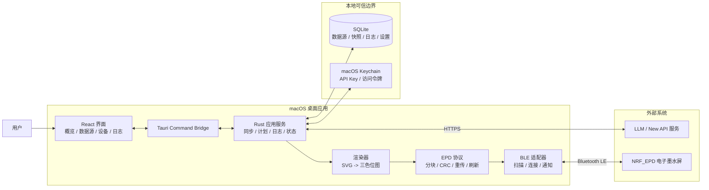
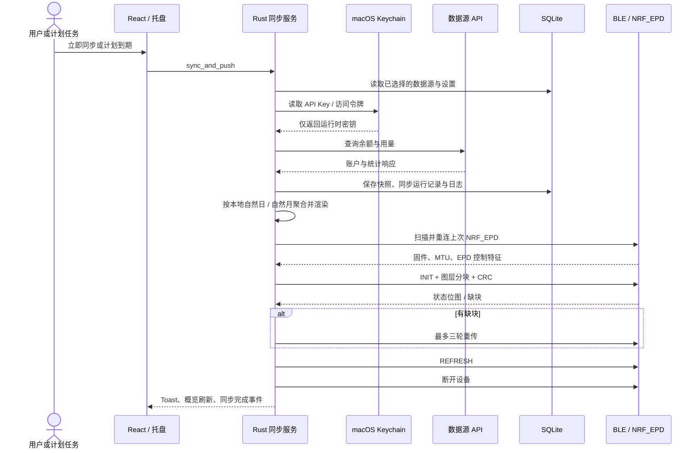
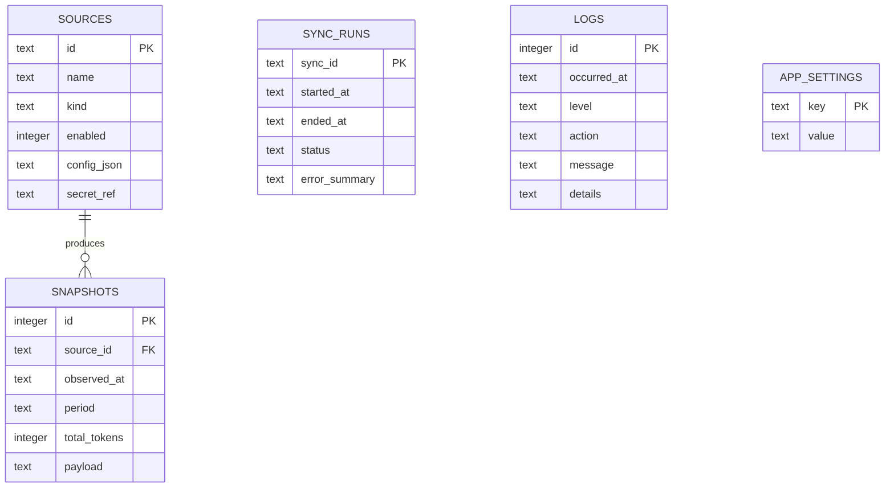
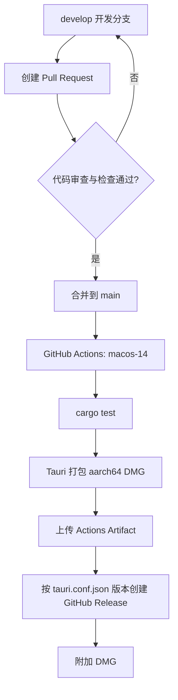

# LLM E-Ink Dashboard

面向 macOS 的本地优先 LLM 用量仪表盘。它从已选择的数据源读取余额与用量，生成适配三色电子墨水屏的仪表盘图像，并通过 BLE 推送到 `NRF_EPD` 设备。

应用不把 API Key 写入 SQLite 或前端持久化状态。密钥保存在 macOS Keychain，数据、日志和设备配置保存在本机。

## 功能

- 数据源管理：支持 DeepSeek、OpenAI-compatible、New API 与受控脚本数据源。
- New API 个人访问令牌：读取账户余额、今日自然日与本月自然月 `token_used` 汇总。
- 用量概览：今日 TOKEN、本月 TOKEN、余额与当前选择的数据源。
- 电子墨水屏：扫描 `NRF_EPD`、读取固件与 EPD 特征、生成预览、三色图层渲染、CRC 分块传输与缺块重传。
- 自动同步：按计划刷新数据、连接上次使用的设备、推送完成后断开。
- 本地日志：同步、设备连接和传输事件分页查看，保留 30 天。
- macOS 集成：托盘菜单、关闭隐藏窗口、重新打开、登录启动与应用内版本显示。

## 系统架构



### 分层职责

| 层 | 目录 | 职责 |
| --- | --- | --- |
| 界面 | `src/app` | React 页面、Toast、设备菜单、版本显示与状态呈现。 |
| 桥接 | `src/lib/tauri.ts` | 前端对 Tauri commands 的类型化调用。 |
| 应用服务 | `src-tauri/src/commands.rs` | 数据源、同步、设备、计划、日志与设置命令。 |
| 数据源 | `src-tauri/src/providers` | 各供应商认证、验证、余额与用量查询。 |
| 存储与密钥 | `src-tauri/src/storage`、`src-tauri/src/secrets` | SQLite 业务数据与 Keychain 凭据引用。 |
| 设备与图像 | `src-tauri/src/ble.rs`、`epd`、`render` | BLE、EPD 报文、三色渲染与预览。 |

## 同步与推送流程



### 用量边界与 New API

New API 个人访问令牌模式要求配置 `baseUrl`、`userId` 和访问令牌。同步时使用：

| 指标 | 接口 | 统计边界 | 汇总字段 |
| --- | --- | --- | --- |
| 余额 | `/api/user/self` | 当前账户 | `quota`、`used_quota` |
| 今日 TOKEN | `/api/data/self` | 系统本地时区当天 `00:00` 至当前时间 | 所有记录的 `token_used` |
| 本月 TOKEN | `/api/data/self` | 系统本地时区本月 1 日 `00:00` 至当前时间 | 所有记录的 `token_used` |

针对 CDN 缓存或截断响应，应用为时间段查询附带唯一请求标识和无缓存头，连续请求三次并选择最大有效汇总值。快照也记录无敏感信息的查询起止时间与记录数，便于排查。

## 本地数据模型



- 数据库位置：`~/Library/Application Support/LLM E-Ink Dashboard/llm-eink-dashboard.sqlite`
- `secret_ref` 是 Keychain 引用，不是密钥内容。
- 快照以数据源、账户、模型、周期和观察时间去重。
- 日志会在数据库打开时自动清理 30 天前的记录。

## EPD 设备协议

设备必须以 `NRF_EPD` 开头广播，并暴露 EPD vendor 服务：

| 项目 | 值 |
| --- | --- |
| 服务 UUID | `62750001-d828-918d-fb46-b6c11c675aec` |
| 控制特征 UUID | `62750002-d828-918d-fb46-b6c11c675aec` |
| 特征能力 | 同时支持 Write 与 Notify 或 Indicate |
| 固件 `>= 0x20` | CRC 分块、状态位图校验与缺块重传 |
| 旧固件或版本未知 | 传统图像传输回退路径 |

传输成功只代表报文与设备状态确认完成；应以设备实际刷新画面作为最终验收依据。

## 开发

### 前置条件

- macOS 11 或更高版本。
- Node.js 22。
- Rust stable 与 Xcode Command Line Tools。
- 蓝牙与 Keychain 访问权限，用于真机设备和真实数据源验证。

### 本地运行

```bash
npm ci
npm run tauri dev
```

### 质量检查

```bash
npm run build
cargo test --manifest-path src-tauri/Cargo.toml
cargo fmt --manifest-path src-tauri/Cargo.toml -- --check
```

### 构建 DMG

```bash
npm run tauri bundle -- --bundles dmg
```

输出路径：

```text
src-tauri/target/release/bundle/dmg/LLM E-Ink Dashboard_<version>_aarch64.dmg
```

当前 DMG 没有 Developer ID 签名和 notarization。首次打开时如遇 Gatekeeper 提示，请在确认来源可信后通过 macOS 的“隐私与安全性”放行。

## 分支与发布流程

开发在 `develop` 分支进行，通过 Pull Request 合并到 `main`。合并完成后 GitHub Actions 在 Apple Silicon runner 上执行测试、构建 DMG 并创建 GitHub Release。



工作流定义在 [`.github/workflows/build-macos-dmg.yml`](.github/workflows/build-macos-dmg.yml)。它只接受 `develop` 合并到 `main` 的 PR 触发 Release；手动触发只生成临时 Artifact。每次发布前必须递增以下三个版本号：

- `package.json`
- `src-tauri/Cargo.toml`
- `src-tauri/tauri.conf.json`

## 项目结构

```text
.
├── src/                         # React 前端
│   ├── app/App.tsx              # 页面与交互
│   ├── lib/tauri.ts             # Tauri command 客户端
│   └── styles/app.css
├── src-tauri/
│   ├── src/
│   │   ├── commands.rs          # 应用命令与同步编排
│   │   ├── providers/           # DeepSeek / New API / 脚本适配器
│   │   ├── storage/             # SQLite 仓储
│   │   ├── secrets/             # macOS Keychain
│   │   ├── ble.rs               # CoreBluetooth
│   │   ├── epd/                 # EPD 报文与重传
│   │   └── render/              # SVG 与三色位图
│   ├── capabilities/            # Tauri ACL
│   └── tauri.conf.json
└── .github/workflows/           # CI / Release
```

## 安全原则

- API Key、个人访问令牌仅保存于 macOS Keychain。
- SQLite、日志、前端状态均不保存明文密钥。
- 自定义脚本只接受 UTF-8 JSON，具有 30 秒超时与 1 MB 输出上限。
- 不要在 Issue、日志、截图或 Git 提交中粘贴访问令牌。

## 排障

| 现象 | 检查项 |
| --- | --- |
| New API 数据低于服务端页面 | 确认当前选择的是正确数据源；在“日志”检查同步记录；重新同步后核对查询记录数；确认本地应用版本。 |
| Keychain 凭据找不到 | 在“数据源”编辑该来源，重新输入 API Key 或个人访问令牌并保存；检查 Keychain 是否已解锁。 |
| 找不到 EPD | 保持设备以 `NRF_EPD` 名称广播；授权蓝牙；在左上设备菜单持续扫描。 |
| EPD 传输成功但屏幕未刷新 | 核对服务 UUID、控制特征能力和固件版本；保留“日志”中的 MTU、分块数和重试信息。 |
| 不确定运行的是哪个安装包 | 查看左侧底部“版本”；它来自 Tauri 运行时的应用版本，而非前端静态文本。 |
